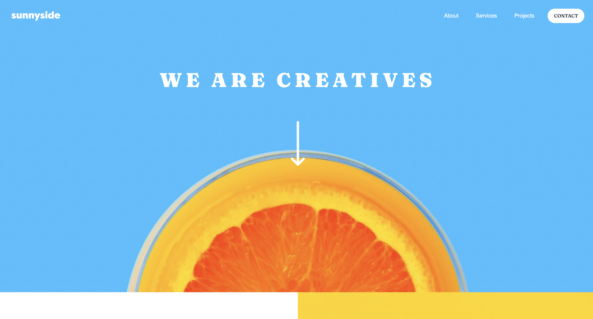

# Frontend Mentor - Sunnyside agency landing page solution

This is a solution to the [Sunnyside agency landing page challenge on Frontend Mentor](https://www.frontendmentor.io/challenges/sunnyside-agency-landing-page-7yVs3B6ef).

## Table of contents

- [Overview](#overview)
  - [The challenge](#the-challenge)
  - [Screenshot](#screenshot)
  - [Links](#links)
- [My process](#my-process)
  - [Built with](#built-with)
  - [What I learned](#what-i-learned)
  - [Useful resources](#useful-resources)
- [Author](#author)

## Overview

### The challenge

Users should be able to:

- View the optimal layout for the site depending on their device's screen size
- See hover states for all interactive elements on the page

### Screenshot

### Links

- Solution URL: https://github.com/Ewelina-EN/sunnyside-agency-landing-page
- Live Site URL: https://ewelina-en.github.io/sunnyside-agency-landing-page/

## My process

### Built with

- Semantic HTML5 markup
- CSS custom properties
- Flexbox
- CSS Grid
### What I learned

After this project, I will do every next project with Mobile-first workflow: Taking a Mobile First approach aims to reverse the workflow of designing for desktop and scaling down the design for mobile afterwards.

Looking for an idea how to make a menu for mobile devices, I read for the first time about CSS property: opacity. I decided to use this property. It is used in a condition in the JavaScript file. 

Like every project, I used the html validator to validate the document.

### Useful resources

- About opacity CSS property: https://developer.mozilla.org/en-US/docs/Web/CSS/opacity
- Markup Validation Service: https://validator.w3.org/

## Author

- Website - [GitHub profile](https://github.com/Ewelina-EN)
